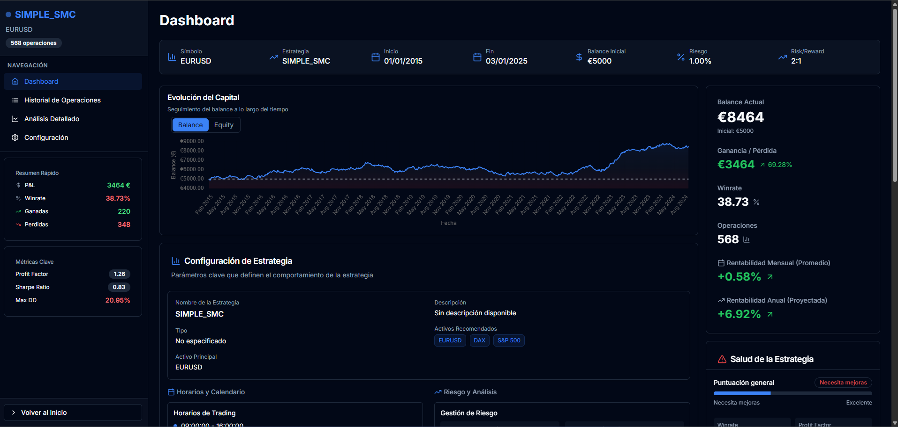
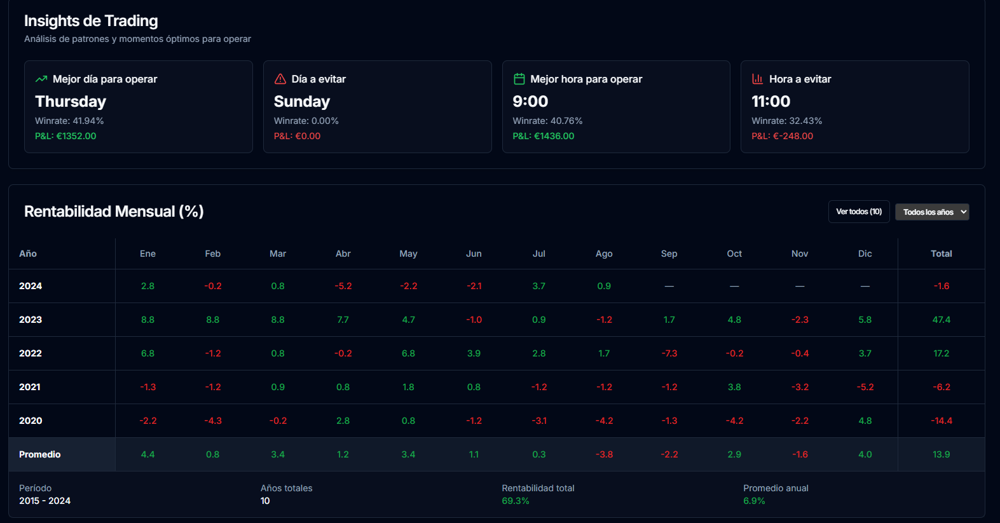
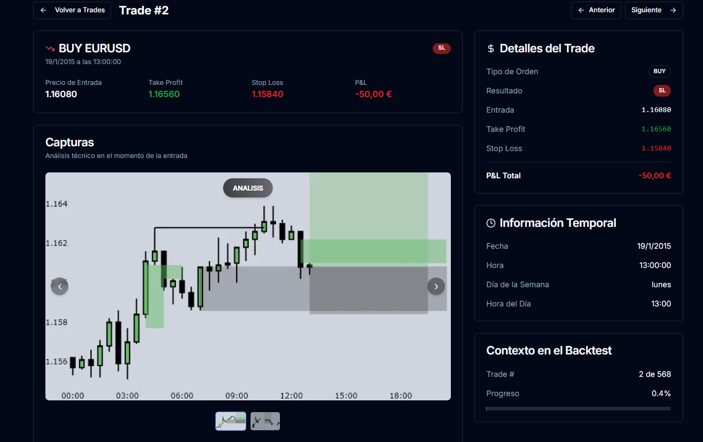
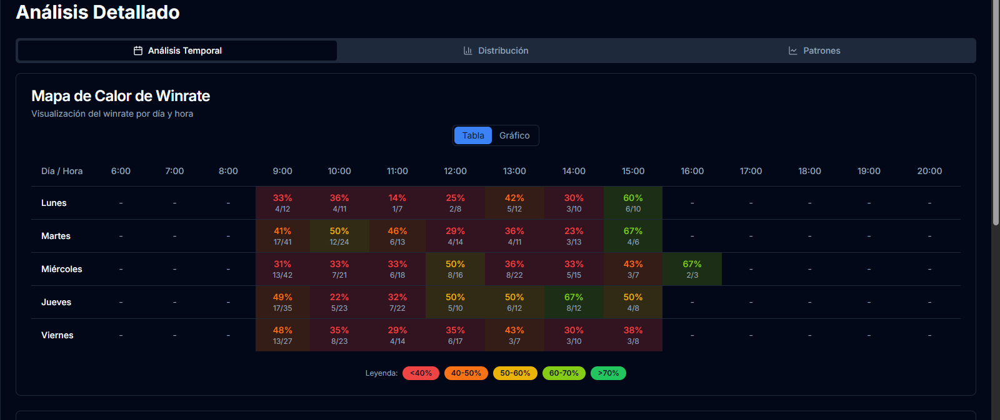
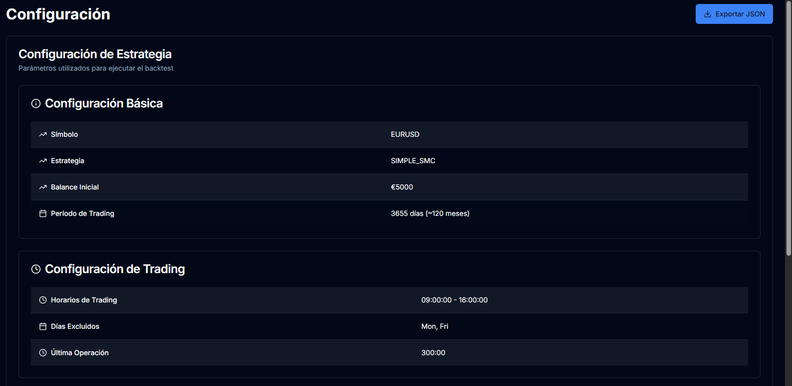

# 📈 Backtest Results Viewer

Backtest Results Viewer is a modern web interface for exploring, analyzing, and comparing backtest results. Built with **Next.js**, **TypeScript**, and **TailwindCSS**, it provides an intuitive and data-rich environment for reviewing strategy performance through detailed charts, metrics, and trade analysis.

This project is part of a modular backtesting ecosystem, integrating seamlessly with:

- **🧩 [Backtester-py](https://github.com/jabifx/Backtester-py)** — Python backend that runs simulations and stores results
- **💻 [Backtest Dashboard](https://github.com/jabifx/Backtest-dashboard)** — Real-time control panel that launches and monitors backtests

## 🧰 Tech Stack

- **Framework**: Next.js 14 (TypeScript)
- **UI Layer**: TailwindCSS, Radix UI, Lucide Icons
- **Charts**: Chart.js, Recharts
- **State & Logic**: Custom React Hooks
- **Data Source**: REST API from Backtester-py

## ✨ Features

- **📊 Interactive Visualizations** – Explore equity curves, drawdowns, and trade distributions
- **⚖️ Strategy Comparison** – View multiple backtests side-by-side
- **🔍 Detailed Metrics** – Includes profitability ratios, win/loss stats, and performance summaries
- **🎯 Trade Insights** – View annotated screenshots of trade entries generated by the backend
- **🎨 Theme Support** – Light and dark modes for better visual clarity
- **⚙️ API Integration** – Automatically fetches and displays data from the backend
- **🪶 Minimal & Responsive UI** – Built for clarity and usability on all devices

## 🖼️ Gallery

<p align="center">
  
  
</p>
<p align="center">
  
  
</p>
<p align="center">
  
</p>


## 🔗 Integration

This app forms the visual analysis layer of the full backtesting system:

- **Backtester-py**: Runs simulations and captures trade data with screenshots.
- **Backtest Dashboard**: Triggers and monitors backtests in real time.
- **Backtest Results Viewer**: Displays stored results, detailed charts, and captured analyses.

## 🚀 Getting Started

1. **Clone the Repository**

   ```bash
   git clone https://github.com/jabifx/Backtest-results.git
   cd Backtest-results
   ```

2. **Install Dependencies**

   ```bash
   npm install
   ```

3. **Run in Development Mode**

   ```bash
   npm run dev
   ```

4. **Build for Production**

   ```bash
   npm run build && npm start
   ```

## 📜 License

MIT © 2025